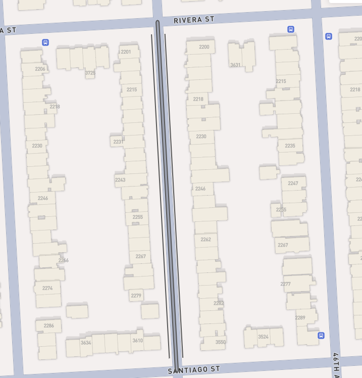
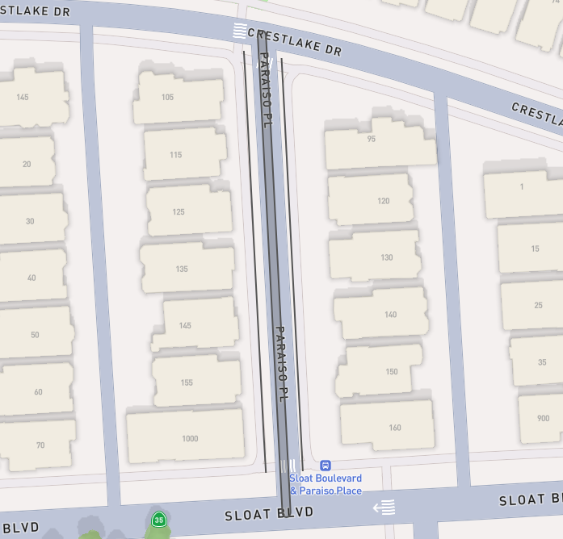
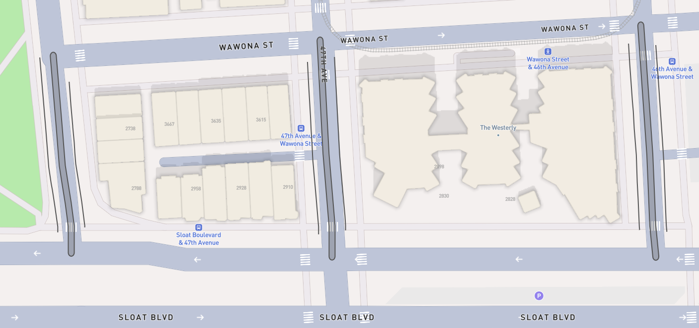

# INRIX Assessment - Roadside Processor

## How to Run the Project

### 1. Prerequisites

Before running the project, ensure you have the following installed:

- **Java Development Kit (JDK) 17** (or the version specified in your pom.xml)
   - Verify installation: `java -version` and `javac -version`
- **Apache Maven**
   - Verify installation: `mvn -v`
- **Git** (if cloning the repository)

### 2. Getting the Project

#### Option A: Clone from Git Repository
```sh
git clone https://github.com/Anugrah-T-Sebastian/assessment.git
cd assessment
```

#### Option B: Using Downloaded Source
1. Extract the project archive
2. Open terminal in the extracted directory

### 3. Project Structure

Important directories:
- `src/main/java` - Source code
- `src/test` - Unit tests
- `data/` - Input JSON files (areas.json and zones.json)
- `output/` - Where generated GeoJSON will be saved

### 4. Building the Project

From the project root directory (where pom.xml is located):

```sh
mvn clean package
```

This will:
1. Clean previous builds
2. Compile all source code
3. Run unit tests
4. Package the application into a JAR file in `/target`

### 5. Running the Application

#### Standard Execution:
```sh
java -cp target/assessment-1.0-SNAPSHOT.jar com.inrix.Main
```

#### Using Maven Directly:
```sh
mvn exec:java -Dexec.mainClass="com.inrix.Main"
```

### 6. Expected Output

After successful execution:
- The program will process the input files from `data/`
- Generate output in folder [output/zones.geojson](./output/zones.geojson)
- Log progress to console

### 7. Testing

To run unit tests:
```sh
mvn test
```

### 8. Custom Configuration

You can modify these constants in `Main.java` to change file paths:
```java
private static final String AREA_FILE_PATH = "data/areas.json";
private static final String ZONES_FILE_PATH = "data/zones.json"; 
private static final String OUTPUT_FILE_PATH = "output/zones.geojson";
```

Or run with custom paths:
```sh
java -jar target/assessment-1.0-SNAPSHOT.jar /custom/path/areas.json /custom/path/zones.json /custom/output/path.geojson
```

### 9. Troubleshooting

Common issues:
- **File not found errors**: Ensure input files exist in specified paths
- **Java version mismatch**: Verify correct JDK version
- **Missing dependencies**: Run `mvn clean install`

For any other issues, check the logs or contact the development team.

---

## Output GeoJSON File
The generated [`zones.geojson`](./output/zones.geojson) has been visualised below. The can also be visualised on [https://geojson.io/](https://geojson.io/#map=15.3/37.73998/-122.494298)

### GeoJSON Visualisation


[](./output/zones.geojson)
<br>
*(Click the image to view the output file)*


[](./output/zones.geojson)  
<br>
*(Click the image to view the output file)*


[](./output/zones.geojson)
<br>
*(Click the image to view the output file)*

